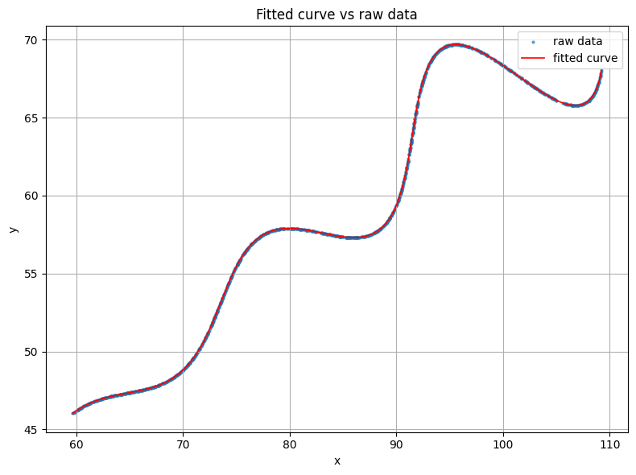

# FLAM_Assignment_Research_and_Development
Given parametric equation of the curves

$$
x = t \cos(\theta) - e^{M|t|}\sin(0.3t)\sin(\theta) + X
$$

$$
y = 42 + t \sin(\theta) + e^{M|t|}\sin(0.3t)\cos(\theta)
$$

and our objective is to find $$\theta$$, M, X which are lying in the ranges

$$0^\circ < \theta < 50^\circ$$
 $$-0.05 < M < 0.05$$ 
 $$0 < X < 100$$

and parameter "t" is in the range   

 $$6 \leq t \leq 60$$ 

The given dataset "xy_data.csv" contains 1500 (x, y) points sampled from this curve.
## Approach

The first thing I noticed was that the dataset only contained the `(x, y)` coordinates of the points. The parameter `t`, which generates the curve, was not provided. Because of this, I couldn't directly substitute the points into the equations or assume that consecutive rows corresponded to increasing values of `t`.

To better understand the data, I first plotted all the points. The scatter plot clearly showed the overall shape of the curve, but it also revealed that the points were not stored in any meaningful order. Instead of following the curve sequentially, they appeared to be randomly shuffled. This meant that using the row index as an approximation for `t` would not work.

While studying both the plotted data and the given equations, I noticed that the curve looked like a translated and rotated version of a much simpler curve. The constant `42` represents a vertical translation, while the unknown parameter `X` represents a horizontal translation. The remaining terms involving `sin(θ)` and `cos(θ)` have exactly the form of a two-dimensional rotation.

This observation led me to rewrite the equations in a more compact form by defining

$$
s(t)=e^{M|t|}\sin(0.3t).
$$

The original equations can then be rewritten as

$$
x-X=t\cos\theta-s(t)\sin\theta
$$

$$
y-42=t\sin\theta+s(t)\cos\theta
$$

These equations have the same form as a two-dimensional rotation followed by a translation. Since a rotation matrix is orthogonal, the transformation can be inverted. For any trial values of `θ` and `X`, the corresponding values of `t` and `s` are

$$
t_i=(x_i-X)\cos\theta+(y_i-42)\sin\theta
$$

$$
s_i=-(x_i-X)\sin\theta+(y_i-42)\cos\theta.
$$

If the chosen parameters are correct, these recovered values satisfy

$$
s_i=e^{M|t_i|}\sin(0.3t_i).
$$

The residual minimized during optimization is therefore

$$
r_i=s_i-e^{M|t_i|}\sin(0.3t_i).
$$

This approach avoids introducing one optimization variable for every data point. Instead, each trial pair `(θ, X)` directly determines the corresponding value of `t`, reducing the optimization to estimating only the three unknown parameters: `θ`, `M`, and `X`.

To improve robustness, I used multiple initial guesses for the optimization. A total of **300** different starting points were generated by combining 12 values of `θ`, 5 values of `M`, and 5 values of `X`. For each initialization, SciPy's `least_squares` function (Trust Region Reflective algorithm) was executed, and the solution with the lowest residual cost was selected as the final result.

## Results

The optimization recovered the following parameters:

| Parameter | Value |
|-----------|------:|
| θ | 30.0000° (0.523598 rad) |
| M | 0.030000 |
| X | 54.999998 |

The figure below compares the fitted curve with the original dataset. The recovered curve closely overlaps the observed points, indicating that the estimated parameters accurately reconstruct the original parametric curve.

  

<i>Figure 1. Comparison between the recovered parametric curve (red) and the original data points (blue).</i>

